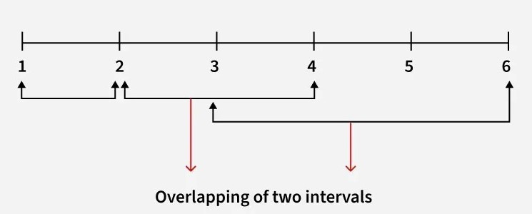

# Maximum Number of Overlapping Intervals

## Problem Statement

You are given an array of intervals `arr[][]`, where each interval is represented by two integers `[start, end]` **(inclusive)**.

Return the **maximum number of intervals that overlap at any point in time**.

## Examples

### Example 1

**Input:**

```text
3
1 2
2 4
3 6
```



**Output:**

```text
2
```

**Explanation:**

The maximum number of overlapping intervals is `2`.

This occurs between:

- `[1, 2]` and `[2, 4]`
- `[2, 4]` and `[3, 6]`

---

### Example 2

**Input:**

```text
4
1 8
2 5
5 6
3 7
```

**Output:**

```text
4
```

**Explanation:**

The maximum number of overlapping intervals is `4`, involving:

- `[1, 8]`
- `[2, 5]`
- `[5, 6]`
- `[3, 7]`

## Constraints

- `2 ≤ arr.size() ≤ 2 × 10^4`
- `1 ≤ arr[i][0] < arr[i][1] ≤ 4 × 10^6`
